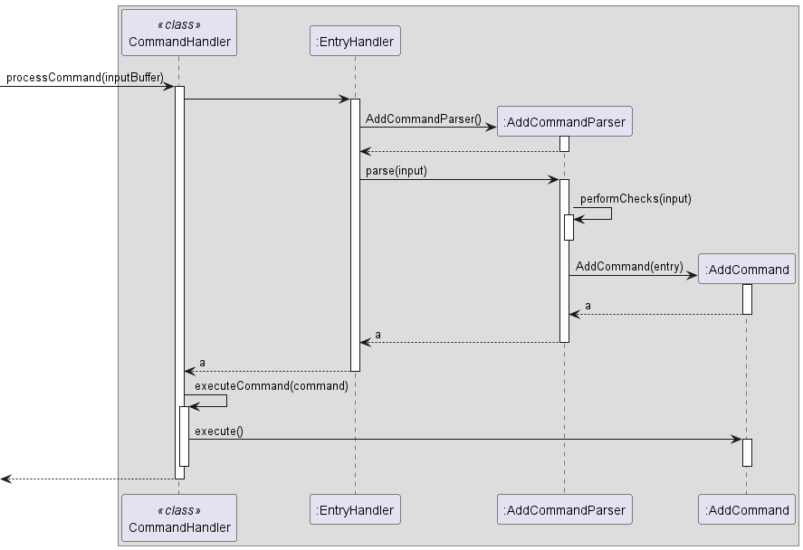

# WildWatch Developer Guide 🦒

## Table of Contents  
- [Introduction](#introduction-)
    - [Purpose](#purpose)
    - [Audience](#audience)
    - [How to use the Developer Guide](#how-to-use-the-developer-guide)
    - [Legend](#legend)
- [Quick Start](#quick-start-)
- [Design & Implementation](#design--implementation-)
    - [System Architecture](#system-architecture)
    - [Main Component](#main-component)
    - [UI Package](#ui-package)
    - [Parser Package](#parser-package)
    - [Command Package](#command-package)
    - [EntryList Package](#entrylist-package)
    - [Entry Package](#entry-package)
    - [Storage Package](#storage-package)
- [Product Scope](#product-scope-)
    - [Target User Profile](#target-user-profile)
    - [Value Proposition](#value-proposition)
- [User Stories](#user-stories-)
- [Non-Functional Requirements](#non-functional-requirements-)
- [Manual Testing](#manual-testing-)
- [Command Summary](#command-summary-%EF%B8%8F)
- [Glossary](#glossary-)
- [Acknowledgements](#acknowledgements-)

--------------------------------------------------------------------------------------------------------------------------------------
<div style="page-break-after: always;"></div>

## Introduction 🐻

Welcome aboard fellow animal lover! We are really excited to have you here! 😉 Wildwatch is a program for a clerk managing wildlife data in a wildlife reserve via the [Command Line Interface (CLI)](#glossary-). Its main job is to store and present animal data required in everyday operations of the wildlife reserve.  

### Purpose
This document specifies the architectural and software design decisions in the implementation of the WildWatch.  
For a detailed guide on how to use the program and explanations on the individual commands, we have our very own [**WildWatch User Guide**](https://ay2324s1-cs2113t-w11-2.github.io/tp/UserGuide.html) for your perusal.

### Audience
The intended audience for this document are developers who would like to look under the hood and understand how WildWatch works, and are looking to introduce new functionalities into WildWatch.

### How to use the Developer Guide   
- Are you new here?     
No worries, head to the [Quick Start](#quick-start-) page.   
- Lost among the pages?    
Head to the [Table of Contents](#table-of-contents) to look for the right pages.     
- Need help with the functionalities?    
Head to the [Features](https://ay2324s1-cs2113t-w11-2.github.io/tp/UserGuide.html#features-) page in the User Guide for detailed guidance.    
- Do you have a question for us?  
Head to the [FAQ](https://ay2324s1-cs2113t-w11-2.github.io/tp/UserGuide.html#faq-) page in the User Guide.
- Do you have a bug to report?   
Head to the [Bug Reporting](https://ay2324s1-cs2113t-w11-2.github.io/tp/UserGuide.html#bug-reporting-) page in the User Guide.   
- Do you want a concise summary of all functionalities?   
Head to the [Command Summary](#command-summary-%EF%B8%8F) page for a summary of all commands.   
- Not sure what that word meant?    
Head to the [Glossary](#glossary-) page for its meaning.

[⬆ Back to top](#table-of-contents)  

<div style="page-break-after: always;"></div>

### Legend

| Symbol         | Meaning                                                     |
| -------------- |------------------------------------------------------------ |
| ❗ IMPORTANT   | These are important instructions that you should follow.   |
| ✏ Note   | These are important details that you should take note of.   |
| ⬆ Back to top  | Click to scroll back up to the `Table of Contents`.         |
| 🐵 🦊 🦁      | Animals indicate you have reached a new section.            |
   
> ❗ IMPORTANT     
> * Capitalized words between angle brackets `< >` is a field to be filled up appropriately by the user.    
>     * E.g., `delete <INDEX>` should be `delete 2`  
> * Anything between curly brackets `{ }` is an optional field that may or may not be filled up by the user.  
>     * E.g., `summary {<SPECIES>}` could be `summary lion` or `summary`.    
    
[⬆ Back to top](#table-of-contents)  

--------------------------------------------------------------------------------------------------------------------------------------
<div style="page-break-after: always;"></div>

## Quick Start 🐵

1. Ensure you have Java 11 or above installed in your Computer. (How do I install [Java 11](https://www.oracle.com/java/technologies/downloads/#java11)? What is my [Java version](https://www.java.com/en/download/help/version_manual.html)?)
   
2. Download the latest `WildWatch.jar` from [here](https://github.com/AY2324S1-CS2113T-W11-2/tp/releases).

3. Copy the file into the folder you want to use as the [home folder](#glossary-) for your WildWatch.

4. Open a [command terminal](https://www.freecodecamp.org/news/command-line-for-beginners/), `cd` into the home folder you put the jar file in, and run the following command: `java -jar WildWatch.jar`.
You should see the welcome screen as the diagram below.

5. Type commands  beside `>>>` and press `Enter` to execute it.   
(e.g. typing `help` and pressing `Enter` will show the help page).  

```
____________________________________________________________
____    __    ____  __   __       _______
\   \  /  \  /   / |  | |  |     |       \
 \   \/    \/   /  |  | |  |     |  .--.  |
  \            /   |  | |  |     |  |  |  |
   \    /\    /    |  | |  `----.|  '--'  |
    \__/  \__/     |__| |_______||_______/
____    __    ____  ___   .___________.  ______  __    __
\   \  /  \  /   / /   \  |           | /      ||  |  |  |
 \   \/    \/   / /  ^  \ `---|  |----`|  ,----'|  |__|  |
  \            / /  /_\  \    |  |     |  |     |   __   |
   \    /\    / /  _____  \   |  |     |  `----.|  |  |  |
    \__/  \__/ /__/     \__\  |__|      \______||__|  |__|
____________________________________________________________
Hello there! Welcome to WildWatch!

Checking if "WildWatch.txt" already exists...
File does not exist.
Creating new file...
File created successfully.
What would you like to do?
____________________________________________________________
>>> 
```

[⬆ Back to top](#table-of-contents)

--------------------------------------------------------------------------------------------------------------------------------------
<div style="page-break-after: always;"></div>

## Design & Implementation 🐸

### System Architecture


The **_Architecture Diagram_** above shows a high-level overview of the architectural design of WildWatch.  
Actual detailed implementation may differ from the architectural diagram.  
(e.g., `Parser` in the diagram encompasses the `Execute`, `Error`, and `Parser` packages).  
  
WildWatch is comprised of 7 major components.  
- `Main`: Entry point of the program.
- `UI`: A package that receives input from, and prints output to the user.
- `Parser`: A package that processes and interprets the input command of the user.
- `Command`: A package that does specific task according to the command of the user.
- `EntryList`: A package that stores all the wildlife data, while the program is running.
- `Entry`: A package that stores individual wildlife data, while the program is running.
- `Storage`: A package that saves and retrieves all the wildlife data from the local storage

[⬆ Back to top](#table-of-contents)  
  
  
 
The **_Generic Sequence Diagram_** above shows how the components in the architecture interact with each other for a generic command input in WildWatch.  
> ✏ Note: `Command` here is a placeholder, and will be replaced by actual commands. e.g., `ListCommand`.
  
### Main Component  
The `Main` component, residing as a method in the `WildWatch` class, which is the only class without a package, is the entry point of the program.  
  
  

[⬆ Back to top](#table-of-contents)  

<div style="page-break-after: always;"></div>
  
### UI Package  
The `UI` components can be found within the `UI` package.  
It prompts and reads commands from the user and sends the command to `Execute` package to be executed.  
Lastly, it prints an output message upon completion of the command, to show the success of failure of the command execution.  
  


[⬆ Back to top](#table-of-contents)  

<div style="page-break-after: always;"></div>
  
### Parser Package 
The `Parser` components can be found within the `Parser` package.  
It is responsible for parsing the input String of the user, and returning an appropriate `XYZCommand` class.  
If the input is invalid, it throws exceptions to the `Error` package for error handling.  
The **_Parser Class Diagram_** below shows how `Execute`, `Parser`, `Error`, `Command` classes of their respective packages work together.  
  
  
  
[⬆ Back to top](#table-of-contents)

<div style="page-break-after: always;"></div>
  
### Command Package  
The `Command` components can be found within the `Command` package.  

  
The above sequence diagram depicts how WildWatch executes an `add` command.  

### EntryList Package  
The `EntryList` class can be found within the `Entry` package.  
It is resposible for storing all the entry data in an static `ArrayList` class.   
It is responsible for "getting" and "setting" values of individual `Entry` objects.  

[⬆ Back to top](#table-of-contents)  

<div style="page-break-after: always;"></div>

### Entry Package  
The `Entry` class can be found within the `Entry` package.  
Each `Entry` object holds the data of a single animal entry, residing in the static `ArrayList` maintained by `EntryList` class.  

    
The class diagram above shows the relationship beteen the `Entry`, `EntryList`, and `ArrayList` classes.  

[⬆ Back to top](#table-of-contents)  
<div style="page-break-after: always;"></div>
   
### Storage Package   
The `Storage` components can be found within the `Storage` package.   
The components work together to read from previously saved file in the local memory.  
The entry data is then loaded into the program.  
If a valid command that changes the entry data is executed, the relevant changes are saved onto the local file.  

  
The class diagram above shows the relationship between the different classes in the `Storage` package.

   
[⬆ Back to top](#table-of-contents)   
    
--------------------------------------------------------------------------------------------------------------------------------------
<div style="page-break-after: always;"></div>

## Product scope 🦁

### Target user profile

Target user profile for WildWatch is the clerks working in wildlife reserves, who manages the wildlife data.
Since our program is interacted through the [Command Line Interface (CLI)](#glossary-), someone who can type fast will definitely benefit from WildWatch.
This would significantly boost one's productivity.
Since clerks are already accustomed to typing and working with a computer, this program would be ideal for this user profile.


### Value proposition

- **Effortless User Experience**: Designed with simplicity in mind, our product ensures that even users with minimal technical experience can easily navigate and interact with the software.
- **Rapid CLI Interaction**: Unlike traditional GUIs that require multiple clicks and drags, our Command Line Interface (CLI) offers direct command inputs, allowing for faster and more efficient operations.
- **Light & Versatile**: Built to be lean and light, our program ensures seamless performance across a variety of devices, as long as Java is installed, from high-end workstations to older laptops. Regardless of your computer's specifications, our product guarantees a smooth and efficient functioning.
- **Robust Data Protection**: Say goodbye to the vulnerabilities of paper records! Our digital solution offers enhanced data protection, ensuring your records remain safe from damage, loss, or unauthorized access. With advanced encryption and backup mechanisms in place, your data's safety is our priority.
- **Eco-Friendly**: Transition from paper to digital and contribute to a greener planet. Not only does this transition reduce clutter and the risk of loss, but it also significantly diminishes your carbon footprint.
- **Cost-Effective**: Eliminate the recurring costs of paper, printing, and storage. With our solution, you'll experience a noticeable reduction in operational expenses while benefiting from advanced data management capabilities.

[⬆ Back to top](#table-of-contents)

--------------------------------------------------------------------------------------------------------------------------------------
<div style="page-break-after: always;"></div>

## User Stories 🦊

|Version| As a ... | I want to ... | So that I can ...|
|--------|----------|---------------|------------------|
|v1.0|new user|see help instructions|refer to them when I forget how to use the application|
|v1.0|zoo clerk|add an animal entry|record the animals in the zoo, and refer to them afterwards|
|v1.0|zoo clerk|delete an animal entry|remove redundant or invalid animal entry|
|v1.0|zoo clerk|list all the entries|see what entries I have entered previously, and refer to them|
|v1.0|zoo clerk|have an exit command|close the program safely|
|v2.0|zoo clerk|find an entry item by name|locate the entry I want, without having to go through the entire list|
|v2.0|zoo clerk|edit a command|change the entry contents to reflect the changes in the zoo|
|v2.0|zoo clerk|see a summary of all entries|have an idea of the entries at a glance|
|v2.1|zoo clerk|export the entries|easily move my data from one place to another|


--------------------------------------------------------------------------------------------------------------------------------------

## Non-Functional Requirements 🐯

1. Should be portable and working on any mainstream OS as long as it has Java 11 or above installed.
2. Should be able to hold up to 1000 wildlife records without a noticeable drop in performance for typical usage.
3. The average user who is familiar with typing on a keyboard should accomplish their tasks faster with WildWatch than a typical GUI app

[⬆ Back to top](#table-of-contents)

--------------------------------------------------------------------------------------------------------------------------------------
<div style="page-break-after: always;"></div>

## Manual Testing 🐼

### 1. Launching the App  
- Refer to the [Quick Start](#quick-start-) section to get WildWatch set up and running.  

### 2. Getting help  
- Run the `help` command by typing `help` and hitting the `Enter` key on your keyboard.  

### 3. Adding a Wildlife Entry  
- Run the following command `add D/02-03-2023 S/Annam Leaf Turtle N/Ariel R/looks healthy`.  
Expected: Wildlife recorded successfully added.  

- Run the following command `add D/02-03-2023`.  
Expected: No new recorded added.  
 
### 4. Listing Wildlife Entries  
- Run the following command `list`.  
Expected: All wildlife records shown.  
  
  
### 5. Editing a Wildlife Entry   
- Run the following command `edit I/1 D/02-05-2020 R/looks sick`.   
Expected: Successfully edited the wildlife record.    

- Run the following command `edit I/-1 D/02-05-2020 R/looks sick`.   
Expected: Failed to edit as -1 is not a valid index.   
  
  
### 6. Deleting a Wildlife Entry  
- Run the following command `delete 1`.      
Expected: Successfully deleted the first record.    

- Run the following command `delete 0`.    
Expected: Failed to delete a record as 0 is an invalid record.

[⬆ Back to top](#table-of-contents)

<div style="page-break-after: always;"></div>   
  
  
### 7. Getting a summary of the wildlife data
- Run the following command `summary`.    
Expected: A summary of the wildlife record is displayed.  
  
  
### 8. Exporting wildlife data to a local file
- Run the following command `export myobservations.csv`.    
Expected: You will be prompted with further questions, on exporting your data.  
   
  
### 9. Exiting the app
- Run the `bye` command.  
Expected: WildWatch program terminates.       
  
[⬆ Back to top](#table-of-contents)   

--------------------------------------------------------------------------------------------------------------------------------------
<div style="page-break-after: always;"></div>

## Command Summary 🐻‍❄️

| Action                    | Format                                                             |
|---------------------------|--------------------------------------------------------------------|
| Getting Help              | `help`                                                             |
| Adding Entries               | `add D/<DATE> S/<SPECIES> N/<NAME> {R/<REMARKS>}`                  |
| Adding Entries (interactive) | `add i/`                                                           |
| Deleting Entries            | `delete <INDEX>`                                                   |
| Finding Entries            | `find <SEARCH>`
| Editing Entries              | `edit I/<INDEX> {D/<DATE>} {S/<SPECIES>} {N/<NAME>} {R/<REMARKS>}` |
| Summarizing Entries       | `summary {<SPECIES>}`                                              |
| Listing Entries              | `list`                                                             |
| Exporting Entries            | `export {<FILENAME>}`                                              |
| Exit                      | `bye`                                                              |

[⬆ Back to top](#table-of-contents)

--------------------------------------------------------------------------------------------------------------------------------------
<div style="page-break-after: always;"></div>

## Glossary 🐨
We are here to help you with terminologies used in the user guide, that may not be familiar to you.

| Terminology    | Meaning                                                     |
| -------------- |------------------------------------------------------------|
| Command Line Interface   | A way to communicate with your computer using texts. |
| Home Folder | Folder in which your program resides |

--------------------------------------------------------------------------------------------------------------------------------------


## Acknowledgements 🐺
Reference - [woodenclock](https://github.com/woodenclock/ip.git)  
Reference - [AB3 Developer Guide](https://se-education.org/addressbook-level3/DeveloperGuide.html)  
Meet the [people](https://ay2324s1-cs2113t-w11-2.github.io/tp/AboutUs.html) behind WildWatch!  

[⬆ Back to top](#table-of-contents)

--------------------------------------------------------------------------------------------------------------------------------------
